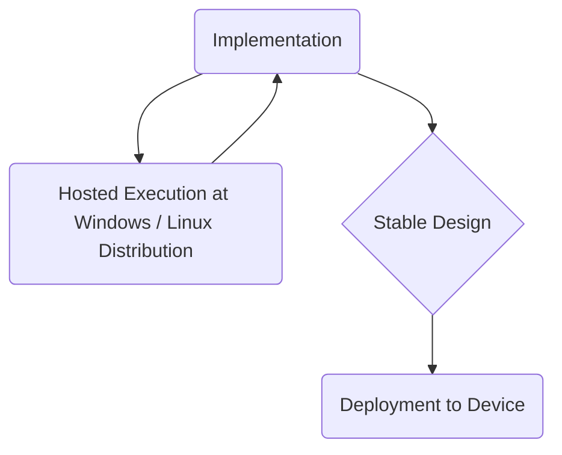

# moveOS

The ***moveOS*** comprises of a *lightweight Kernel* with supporting libraries that greatly help in developing and deploying *movable and immovable smart-objects* covering a variety of domains. The main desirable features of the OS include:

&nbsp; &nbsp; &nbsp; :star: &nbsp; *Ease of use*

&nbsp; &nbsp; &nbsp; :star: &nbsp; *Lightweight deployments*
  
&nbsp; &nbsp; &nbsp; :star: &nbsp; *Energy efficiency*
  
&nbsp; &nbsp; &nbsp; :star: &nbsp; *Real-time responsiveness*
  
&nbsp; &nbsp; &nbsp; :star: &nbsp; *Encouraging the task and event-based designs*
  
&nbsp; &nbsp; &nbsp; :star: &nbsp; *Natively supporting the State Machines*
  
&nbsp; &nbsp; &nbsp; :star: &nbsp; *Graphical and headless deployments*
  
&nbsp; &nbsp; &nbsp; :star: &nbsp; *Remote interfacing through stand-alone graphical and cloud-based services*
  
&nbsp; &nbsp; &nbsp; :star: &nbsp; *Ready-to-use security and extensible modules*
  
&nbsp; &nbsp; &nbsp; :star: &nbsp; *Low-code and no-code facilities*
  
&nbsp; &nbsp; &nbsp; :star: &nbsp; *ROS integration*
  
&nbsp; &nbsp; &nbsp; :star: &nbsp; *High configurability, extensibility and agility*

&nbsp;

## Run-time Environments

From the beginning, the ***moveOS*** is intended to be deployed on bare-metal devices, Windows and Linux distributions; though, its behavior can change depending on deployed environments and underlying hardware features. The requisite workflow is envisioned as:

&nbsp;

## Modules

***moveOS*** comprises of two types of modules i.e., Compiled with the Kernel itself, and the ones loaded as pure modules that can be unloaded at any time - just like the Linux Kernel modules.

&nbsp;

## Documentation

Documentation is kept in docs folder.

&nbsp;

For using the OS and libraries:

  * Defining the [tasks](./docs/usage/Tasks.md)
  * Defining the [State Machines](./docs/usage/StateMachine.md)

&nbsp;

How it is arranged?

  * Overall [Architecture](./docs/contrib/Architecture.md)
  * Conditional Compilation [Definitions](./docs/contrib/Defines.md)
